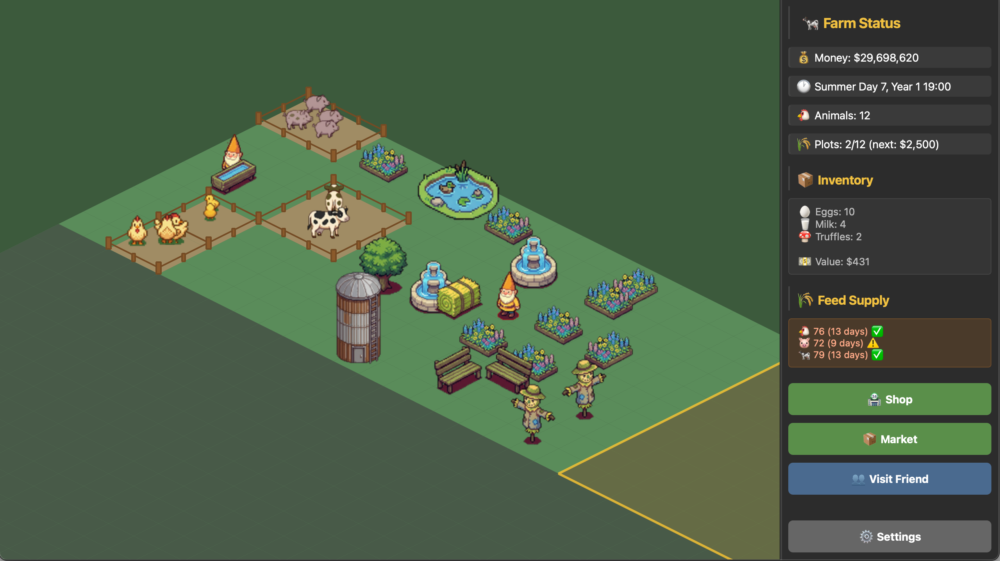

# 🐄 Anki Animal Ranch

> **Turn your Anki study sessions into an immersive isometric farming adventure!**


---

<div align="center">
  
  <br/>
  <em>Build your dream farm while mastering your flashcards!</em>
</div>

---

## 🎮 What is Anki Animal Ranch?

Anki Animal Ranch is a **gamification addon** for [Anki](https://apps.ankiweb.net/) that transforms your flashcard studying into a rewarding farm simulation. Every card you answer advances time on your farm—animals grow, produce resources, and you earn coins to expand your empire!

### ✨ The Core Loop

```
📚 Answer Cards → ⏰ Time Passes → 🐣 Animals Grow → 🥚 Products Made → 💰 Earn Money → 🏗️ Expand Farm
```

---

## 🌟 Features

### 🐔 Animal Husbandry
Raise **chickens**, **pigs**, and **cows** through three growth stages:

| Stage | Chickens | Pigs | Cows |
|-------|----------|------|------|
| 🐣 Baby | Chick | Piglet | Calf |
| 🐤 Teen | Pullet | Shoat | Heifer |
| 🐓 Adult | Hen (lays eggs!) | Hog (finds truffles!) | Cow (produces milk!) |

### 🏗️ Building System
- **Chicken Coops** - House your flock
- **Pigsties** - Keep your pigs happy
- **Cow Pastures** - Room for your cattle
- **Move & Rotate** - Arrange your farm your way

### 🎨 Decorations
Beautify your farm with **19 decorative items**:
- 🌸 Flower Beds & Gardens
- ⛲ Fountains & Ponds
- 🌳 Trees & Bushes
- 🎃 Scarecrows & Gnomes
- 🪵 Benches, Fences & More!

### 💰 Economy
- **Shop** - Purchase animals, buildings, and decorations
- **Market** - Sell your farm products for coins
- **Zone Unlocking** - Expand your farmland as you progress

### 🧑‍🤝‍🧑 Social Features
- **Create an Account** - Choose a unique username
- **Visit Friends** - Explore your friends' farms in read-only mode
- **Friends List** - Quick access to your farm buddies
- **Cloud Sync** - Your farm saves automatically to the cloud

---

## 📦 Installation

### From AnkiWeb (Recommended)
1. Open Anki
2. Go to **Tools** → **Add-ons** → **Get Add-ons...**
3. Enter code: **`1821134343`**
4. Click **OK** and restart Anki

### Development Setup
```bash
# Clone the repository
git clone https://github.com/azharhussain96/anki-animal-ranch.git
cd anki-animal-ranch

# Run standalone (without Anki)
python run_game.py
```

---

## 🎯 How to Play

### Getting Started
1. **Open Anki** and start reviewing cards
2. Access your farm: **Tools → Anki Animal Ranch**
3. Your farm window appears alongside your review!

### Basic Gameplay

| Action | How |
|--------|-----|
| **Advance Time** | Answer flashcards! Each card = 1 minute of farm time |
| **Buy Animals** | Click 🏪 **Shop** → Animals tab → Select animal |
| **Build Pens** | Click 🏪 **Shop** → Buildings tab → Place on farm |
| **Sell Products** | Click 📦 **Market** → Select products → Sell |
| **Add Decorations** | Click 🏪 **Shop** → Decorations tab → Place & rotate with **R** |

### Managing Your Farm

**Clicking on buildings** opens a details dialog where you can:
- View animals inside
- See production status
- Move the building to a new location

**Clicking on decorations** lets you:
- Move them around
- Rotate them (East/West facing)
- Remove them

### Visiting Friends
1. Click **🧑‍🤝‍🧑 Visit Friend**
2. First time? Create a username (permanent!)
3. Enter a friend's username or select from your list
4. Explore their farm in read-only mode
5. Click **🏠 Return Home** when done

---

## 🎨 Art & Aesthetics

The game features charming **pixel art sprites** in an isometric 2.5D perspective:
- Hand-crafted animal sprites with directional facing (N/S/E/W)
- Growth stage variations for all animals
- Decorations with rotation support
- Isometric tile-based terrain with grass and flowers

---

## 🛠️ Technical Details

### Built With
- **Python 3.9+**
- **PyQt6** - Cross-platform GUI
- **Supabase** - Cloud database for social features
- **Anki Add-on API** - Integration hooks

### Project Structure
```
anki_animal_ranch/
├── core/           # Constants, events, time system
├── models/         # Data models (Farm, Animal, Building, etc.)
├── rendering/      # Isometric view, sprites, tile grid
├── systems/        # Growth system, animal AI
├── ui/             # Main window, dialogs, panels
├── network/        # Supabase client, sync manager
├── data/           # Save manager, account manager
├── utils/          # Logging, math utilities
└── assets/         # Sprites, tiles, UI elements
```

### Building the Addon
```bash
# Bump version
./scripts/bump_version.sh minor  # or patch/major

# Build .ankiaddon file
./scripts/build_addon.sh
```

---

## 🗺️ Roadmap

### ✅ Implemented (v0.2.0)
- [x] Isometric tile-based farm view
- [x] Animal system (chickens, pigs, cows)
- [x] Growth stages (baby → teen → adult)
- [x] Product production (eggs, truffles, milk)
- [x] Building placement and movement
- [x] Decoration system with rotation
- [x] Shop and Market dialogs
- [x] Zone unlocking progression
- [x] Friend visits and cloud sync
- [x] Anki integration (cards = time)

### 🚧 Coming Soon
- [ ] More animal types (sheep, goats, ducks)
- [ ] Seasonal events
- [ ] Achievements and milestones
- [ ] Sound effects and music

---

## 🤝 Contributing

Contributions are welcome! Whether it's bug fixes, new features, or sprite art—feel free to open an issue or submit a PR.

---

## 📄 License

MIT License - see [LICENSE](./LICENSE) for details.

---

## 🙏 Acknowledgments

- Inspired by **Stardew Valley**, **Hay Day**, and the original **Anki Farm Tycoon**
- Pixel art generated with AI assistance and hand-tuned
- Built with love for learning and farming sims 🌾

---

<div align="center">
  <strong>Happy studying and happy farming! 🐄🐔🐷</strong>
</div>
